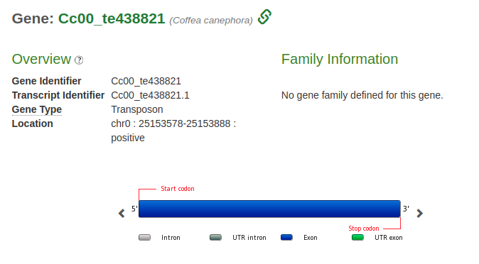
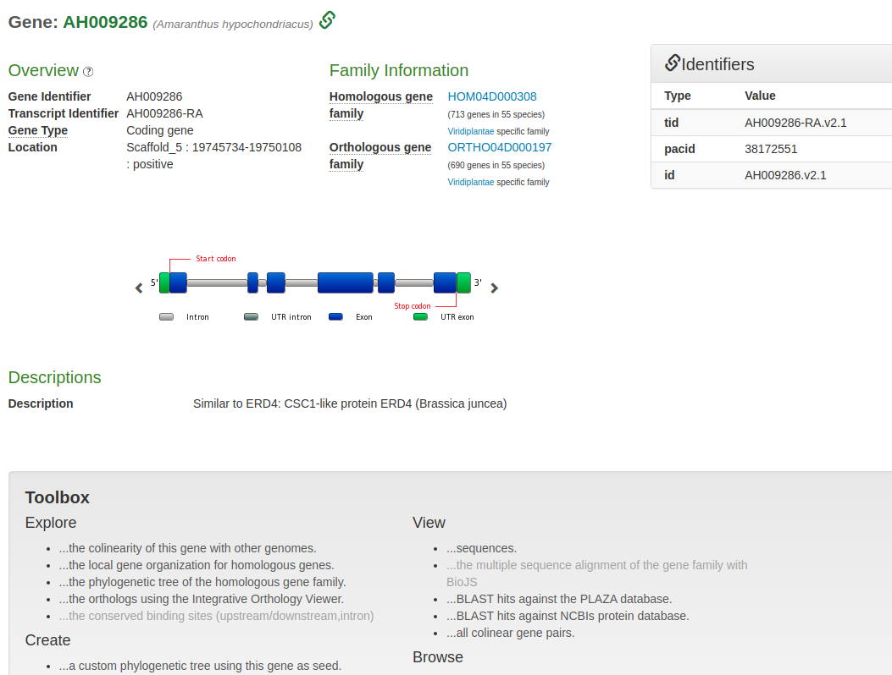
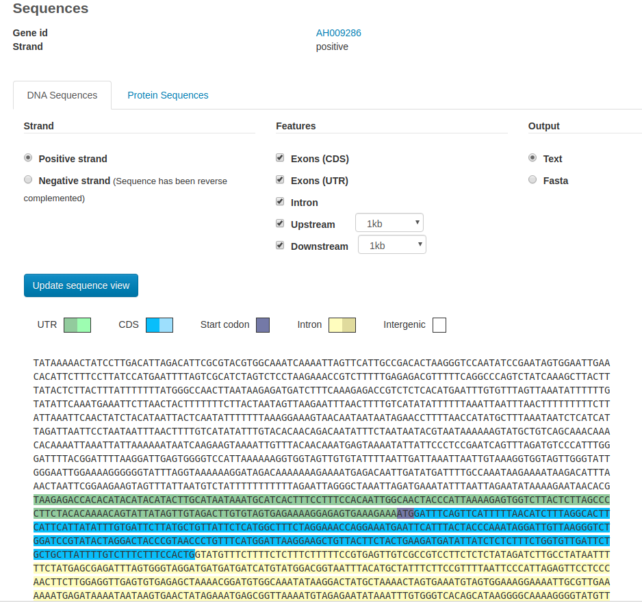
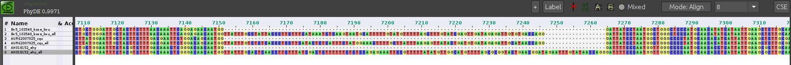

## Plaza_filter

[Dicots PLAZA 4.5](https://bioinformatics.psb.ugent.be/plaza/versions/plaza_v4_5_dicots/)

*Analyze* -> *Gene Family Finder *

<p align="center">

</p>
<p align="center">
Figure 1.- Workflow to process GBS dataset
</p>


<p align="center">

</p>
<p align="center">
Figure 1.- Workflow to process GBS dataset
</p>

<p align="center">

</p>
<p align="center">
Figure 1.- Workflow to process GBS dataset
</p>


```
source("filter_genes.R")

plaza_df <- read.delim("../data/plaza/data.txt")

colnames(plaza_df)

[1] "X.gf_id"                    "X.species"                  "X.genes"                    "Actinidia.chinensis"       
[5] "Amaranthus.hypochondriacus" "Arabidopsis.thaliana"       "Beta.vulgaris"              "Chenopodium.quinoa"        
[9] "Daucus.carota"   

filter_genes("../data/plaza/data.txt", species = c("Arabidopsis.thaliana", "Daucus.carota", "Actinidia.chinensis"))
```

<p align="center">

</p>
<p align="center">
Figure 1.- Workflow to process GBS dataset
</p>


<p align="center">

</p>
<p align="center">
Figure 1.- Workflow to process GBS dataset
</p>

<p align="center">

</p>
<p align="center">
Figure 1.- Example "/data/plaza/HOM04D003678_ali.fas"
</p>


<p align="center">

</p>
<p align="center">
Figure 1.- Example "/data/plaza/HOM04D003678_ali.fas"
</p>


## Download genomes

*Carnegiea gigantea*
```
wget https://sra-download.ncbi.nlm.nih.gov/traces/wgs03/wgs_aux/NC/QR/NCQR01/NCQR01.1.fsa_nt.gz -P data/genomes/

wget https://sra-download.ncbi.nlm.nih.gov/traces/wgs03/wgs_aux/NC/QR/NCQR01/NCQR01.2.fsa_nt.gz -P data/genomes/
```

Unzip
```
gunzip data/genomes/*gz
```

Concatenate
```
cat data/genomes/NCQR01.1.fsa_nt data/genomes/NCQR01.2.fsa_nt > data/genomes/C_gigantea.fsa_nt
```

Delete
```
rm data/genomes/NC*.fsa_nt
```
Create a database
```
makeblastdb -in data/genomes/C_gigantea.fsa_nt -dbtype nucl
```
Blast
```
blastn -query data/plaza/minado_full.fas -db data/genomes/C_gigantea.fsa_nt -out out/C_gigantea_minado_full.txt  -evalue 1e-30 -outfmt 6
```
File with match sequences
```
awk '{print $2}' out/C_gigantea_minado_full.txt | uniq > out/seq_match.txt
```

extract target sequences from the genome

```
xargs samtools faidx data/genomes/C_gigantea.fsa_nt < out/seq_match.txt >> out/C_gigantea.fas
```
#### Prerequisites

##### Software:
- [R 3.6.1](https://www.r-project.org/)


#### Directories:
###### bin
Contains
  * R function `.R`
    * `filter_genes.R`.- this function filters genes that are not present in the selected species (delete zeros).

###### data

Contains the table downloaded from PLAZA:
 * `data.txt`


###### out
Contains the results of all analysis
