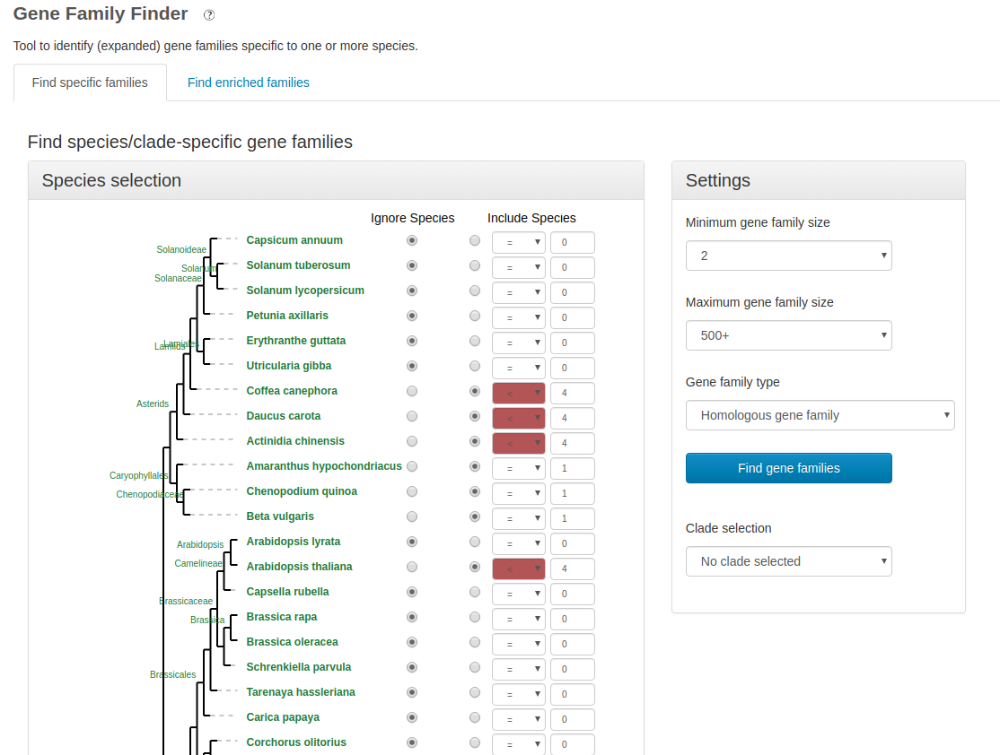
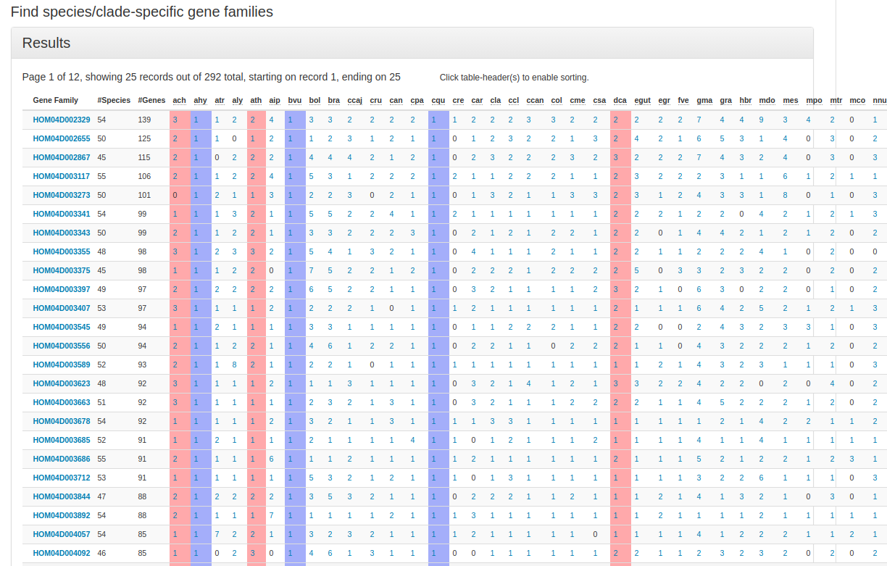
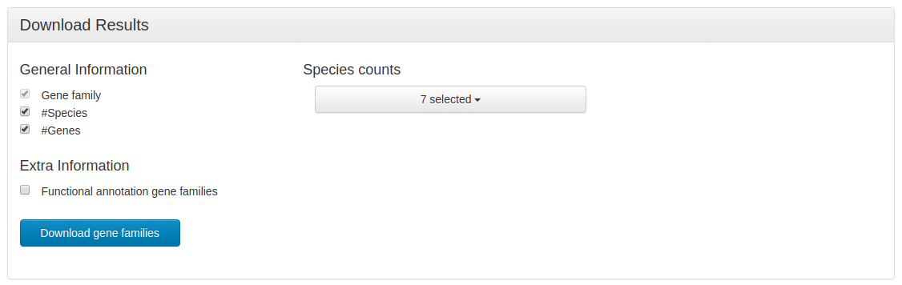

# Plaza_filter

[Dicots PLAZA 4.5](https://bioinformatics.psb.ugent.be/plaza/versions/plaza_v4_5_dicots/)

*Analyze* -> *Gene Family Finder *

Figure 1.- Workflow to process GBS dataset

Figure 1.- Workflow to process GBS dataset

Figure 1.- Workflow to process GBS dataset

#### Prerequisites

##### Software:
- [R 3.6.1](https://www.r-project.org/)

#### Directories:
###### bin
Contains
  * R function `.R`
    * `filter_genes.R`.- this function filters genes that are not present in the selected species (delete zeros).

###### data

Contains the table downloaded from PLAZA:
 * data.txt

###### out
Contains the results of all analysis
